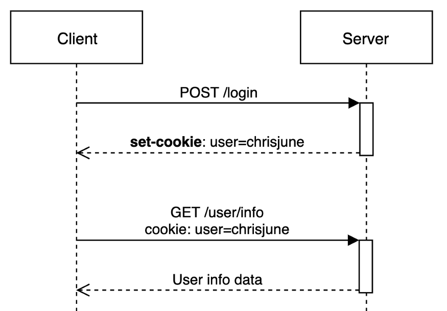
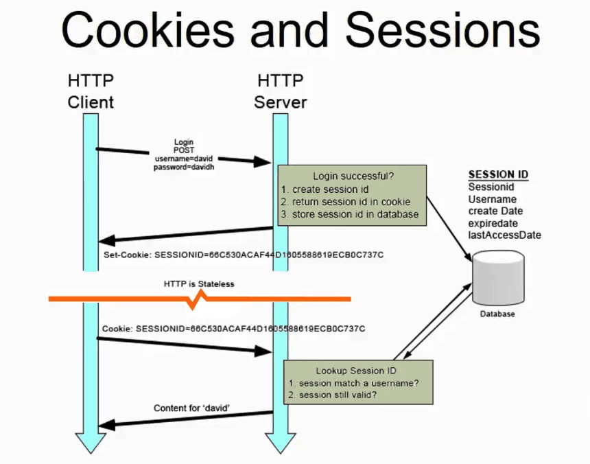

# 쿠키와 세션

## HTTP의 특징

- **비연결성(Connectionless)**
  - 클라이언트가 요청(Request)을 보내고 서버가 응답(Response)을 보내면 연결을 끊는다.
  - 다음 요청을 하기 위해 다시 연결을 맺어야한다.
  - 각 요청 간에 연결이 유지되지 않기 때문에 서버 리소스를 절약할 수 있다.
- **비상태성(Stateless)**
  - 서버는 이전 요청 상태를 기억하지 않음.
  - 매 요청은 독립적이며, 인증/로그인 여부 등을 서버가 자동으로 알 수 없다.

따라서, **사용자 상태(로그인, 장바구니 등)를 유지하기 위해 쿠키와 세션이 필요**함

## 쿠키(Cookie)



- 서버가 클라이언트(브라우저)에 저장하는 작은 데이터 파일
- 특징:

  - 클라이언트에 저장 -> HTTP 요청과 응답에 함께 실려 전송된다(`Set-Cookie`)
  - 로그인 유지, 장바구니 등 상태 관리 가능
  - Set-Cookie 헤더
    ```
      Set-Cookie: <cookie-name>=<cookie-value>
      Set-Cookie: <cookie-name>=<cookie-value>; Domain=<domain-value>
      Set-Cookie: <cookie-name>=<cookie-value>; Expires=<date>
      Set-Cookie: <cookie-name>=<cookie-value>; HttpOnly
      Set-Cookie: <cookie-name>=<cookie-value>; Max-Age=<number>
      Set-Cookie: <cookie-name>=<cookie-value>; Partitioned
      Set-Cookie: <cookie-name>=<cookie-value>; Path=<path-value>
      Set-Cookie: <cookie-name>=<cookie-value>; Secure
    ```

- 장점:
  - 서버 부담 감소 (상태 정보를 클라이언트가 보관)
- 단점:
  - 용량 제한: 대략 도메인 당 4KB, 20개로 제한됨
  - 보안에 취약 (탈취 시 위험)
  - 클라이언트에 저장되므로 위·변조 가능성 존재

## 세션(Session)



- 서버가 클라이언트의 상태 정보를 서버 메모리나 세션 저장소에 보관하는 방식.
- 세션 생성 과정

  1. 사용자가 **인증 정보(아이디, 비밀번호 등)**를 HTTP 요청 Body에 담아 서버로 전송한다.
  2. 서버는 인증 정보가 유효하면 **Session ID**를 생성한다.
  3. 생성된 Session ID는 응답(Response)의 **Set-Cookie 헤더**에 담겨 클라이언트로 전송된다.
  4. 클라이언트는 해당 Session ID를 **쿠키에 저장**한다.
  5. 이후 모든 요청 시, 클라이언트는 Session ID를 **Cookie 헤더**에 담아 서버로 전송한다.
  6. 서버는 전달받은 Session ID를 기반으로 요청자가 누구인지 식별한다.

- 특징:
  - 클라이언트는 세션 ID만 쿠키(또는 URL 파라미터)를 통해 보관.
  - 서버는 세션 ID에 매핑된 상태 정보를 저장/관리.
- 장점:
  - 보안성 높음(민감 데이터는 서버가 관리)
  - 클라이언트 노출 정보 최소화
- 단점:
  - 서버 메모리/저장소 부담 증가
  - 다중 서버 환경에서 세션 동기화 문제 발생

## 쿠키 vs 세션

| 구분      | 쿠키                            | 세션                               |
| --------- | ------------------------------- | ---------------------------------- |
| 저장 위치 | 클라이언트(브라우저)            | 서버 (메모리 / 세션 저장소)        |
| 보안성    | 낮음 (위·변조, 탈취 위험)       | 높음 (민감 데이터 서버 관리)       |
| 서버 부담 | 적음                            | 많음                               |
| 용량 제한 | 4KB 정도                        | 제한 없음(서버 자원 한도 내)       |
| 지속 시간 | 브라우저 종료/만료 시 소멸 가능 | 설정에 따라 유지 가능              |
| 활용 예시 | 자동 로그인, 방문 기록 저장     | 로그인 상태 유지, 사용자 정보 관리 |

## 요약

```
- HTTP는 비연결성과 비상태성 때문에 사용자의 상태를 유지하기 어렵다.
- 이를 보완하기 위해 쿠키나 세션을 사용한다
  - 쿠키: 클라이언트에 상태 저장 (가벼우나 보안 취약)
  - 세션: 서버에 상태 저장 (보안 강하지만 서버 부담 증가)
- 실제 서비스에서는 쿠키와 세션을 함께 사용하는 경우가 많다.
  - ex) 쿠키에는 세션 ID만 저장, 실제 사용자 정보는 서버 세션에서 관리
```
