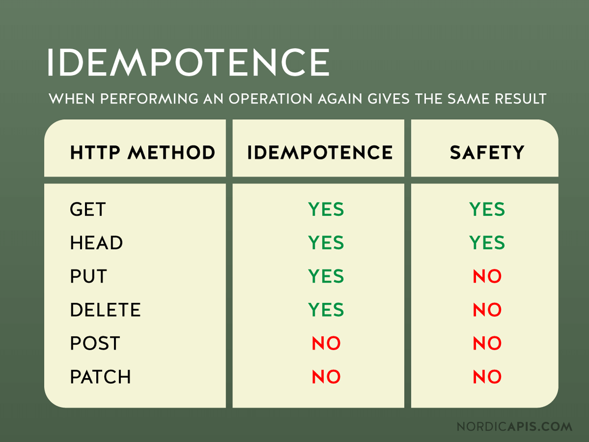

# HTTP 메소드의 멱등성(Idempotent)

## 멱등성

- **같은 요청을 여러 번 보내더라도 결과가 동일하게 유지되는 성질**을 의미한다.
- 즉, 요청을 한 번 보내나 여러 번 보내나 서버의 상태가 변하지 않고 동일해야 한다.
- 멱등성은 `서버의 상태 변화`를 기준으로 판단한다.

## HTTP 메소드별 멱등성

HTTP의 멱등성은 같은 요청을 여러 번 반복했을 때 서버의 최종 상태가 변하지 않고 동일한 결과를 보장하는 성질을 의미한다.

- `GET`: 단순 조회만 수행. 몇 번 요청하더라도 서버의 리소스 상태는 바뀌지 않으므로 멱등함.
- `HEAD`: GET과 비슷하지만 응답 본문은 제외하고 헤더만 반환한다. 조회 성격이므로 역시 멱등함.
- `PUT`: 지정된 리소스를 `새로운 값으로 교체`한다. 여러 번 같은 데이터를 넣으면 결과가 동일하게 유지되므로 멱등함.
- `DELETE`: 리소스를 제거한다. 한 번 삭제하면 이후 같은 요청을 반복해도 삭제된 상태는 유지되므로 멱등함.
- `POST`: 새로운 리소스를 추가하거나 서버의 상태를 바꾸는 연산. 요청을 반복하면 매번 새로운 데이터가 생성될 수 있으므로 멱등하지 않다.
- `PATCH`: 리소스의 일부를 수정한다. 구현 방식에 따라 멱등하게 만들 수도 있지만, 보통은 요청을 반복할 때 결과가 달라질 수 있어서 일반적으로 멱등하지 않다고 본다.

## 안전한 메소드 (Safe Methods)

안전한 메소드란, 서버의 상태를 변화시키지 않는 HTTP 메소드를 의미한다(`GET`, `OPTIONS`, `HEAD`).
`PUT`, `DELETE` 메소드는 멱등성을 갖지만, `PUT`은 리소스를 수정하고, `DELETE`는 메소드를 제거하므로 안전한 메소드라고는 할 수 없다.

## 정리

- REST API 설계 시 멱등성 보장을 고려해야 한다.
- 클라이언트(특히 네트워크 오류로 인한 재전송 상황)에서 같은 요청을 여러 번 보냈을 때, 의도치 않은 서버 상태 변경이 일어나지 않아야 한다.
